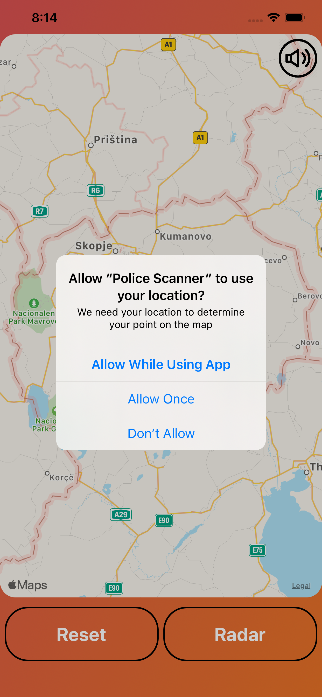

# RadarScanner
IOS Dev - Swift MapKit with FireBase

-----------
This app project is realtime FireBase based locations adding services. It can be used to put realtime zones by user interaction and to addition the same zones will alert users of entering zones.
The app can be used only if the settings on the phone are set to allow gps location as "Allways in use".
The app is still in beta and has debbuging messages.
Sounds can be enabled and disabled.
-----------

App Screanshots

